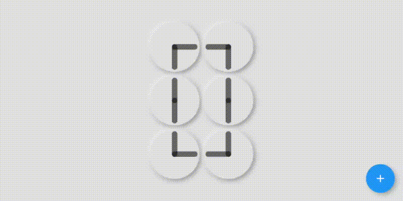

# count_by_clock

An animated widget that can show all digits by six animated clocks.

## Screenshots

 


## Usage

[Example](https://github.com/meTowhid/count_by_clock/blob/master/example/demo.dart)

To use this package :

* add the dependency to your pubspec.yaml file.

```yaml
  dependencies:
    flutter:
      sdk: flutter
    count_by_clock:
```

### How to use

```dart
class Demo extends StatefulWidget {
  @override
  _DemoState createState() => _DemoState();
}

class _DemoState extends State<Demo> {
  int counter = 0;

  void _incrementCounter() {
    setState(() {
      counter++;
    });
  }

  @override
  Widget build(BuildContext context) {
    return Scaffold(
      body: PageView(
        children: <Widget>[
          Container(
            color: Colors.grey[300],
            child: _buildResponsive(
              // Its the most simplest form of using the widget
              CountByClock(counter, tickColor: Colors.black54),
            ),
          ),
          Container(
            color: Colors.deepPurple,
            child: _buildResponsive(
              // Almost all the changeable properties are here
              CountByClock(
                counter,
                digitCount: 1,
                tickColor: Colors.white,
                baseColor: Colors.transparent,
                clockArea: 100,
                tickThickness: 20,
                flatStyle: true,
                curve: Curves.elasticOut,
              ),
            ),
          ),
          Container(
            color: Colors.black87,
            child: _buildResponsive(
              // Almost all the changeable properties are here
              CountByClock(
                counter,
                digitCount: 3,
                tickColor: Colors.white,
                baseColor: Colors.white10,
                clockArea: 100,
                tickThickness: 8,
                flatStyle: true,
                curve: Curves.elasticOut,
              ),
            ),
          )
        ],
      ),
      floatingActionButton: FloatingActionButton(onPressed: _incrementCounter, child: Icon(Icons.add)),
    );
  }

  _buildResponsive(Widget widget) => Center(
    child: SizedBox(
      width: MediaQuery.of(context).size.width * .80,
      height: MediaQuery.of(context).size.height * .80,
      child: FittedBox(
        child: Center(child: widget),
      ),
    ),
  );
}
```

### Created & Maintained By

[Towhid](https://github.com/meTowhid)

#### [Inspiration - ClockClock.com](https://clockclock.com)

# License

    Copyright 2020 Towhid

    Licensed under the Apache License, Version 2.0 (the "License");
    you may not use this file except in compliance with the License.
    You may obtain a copy of the License at

       http://www.apache.org/licenses/LICENSE-2.0

    Unless required by applicable law or agreed to in writing, software
    distributed under the License is distributed on an "AS IS" BASIS,
    WITHOUT WARRANTIES OR CONDITIONS OF ANY KIND, either express or implied.
    See the License for the specific language governing permissions and
    limitations under the License.


## Getting Started

For help getting started with Flutter, view our online [documentation](https://flutter.io/).

For help on editing package code, view the [documentation](https://flutter.io/developing-packages/).
